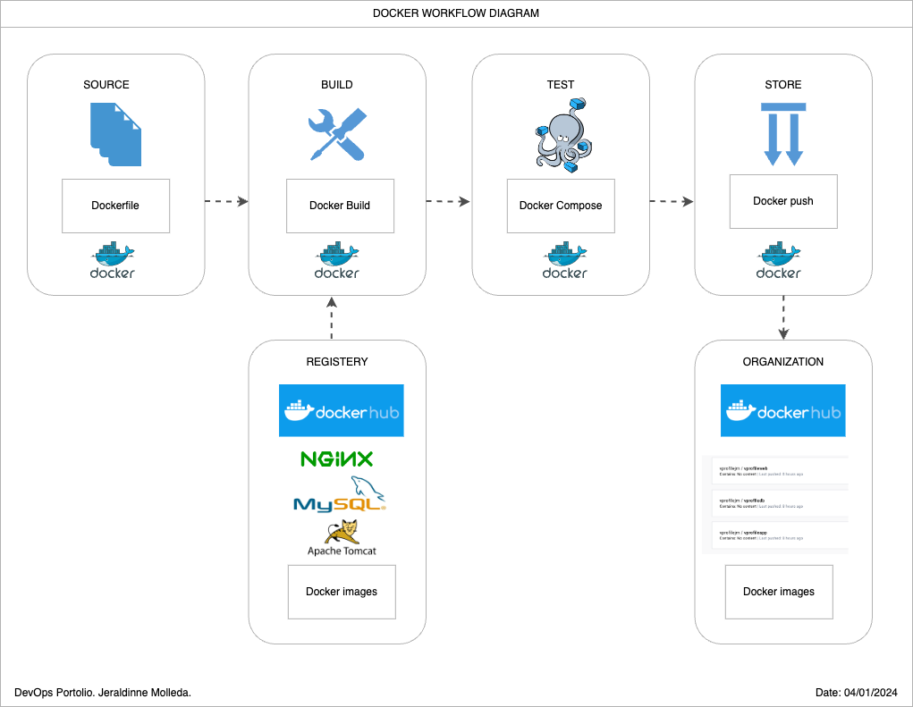
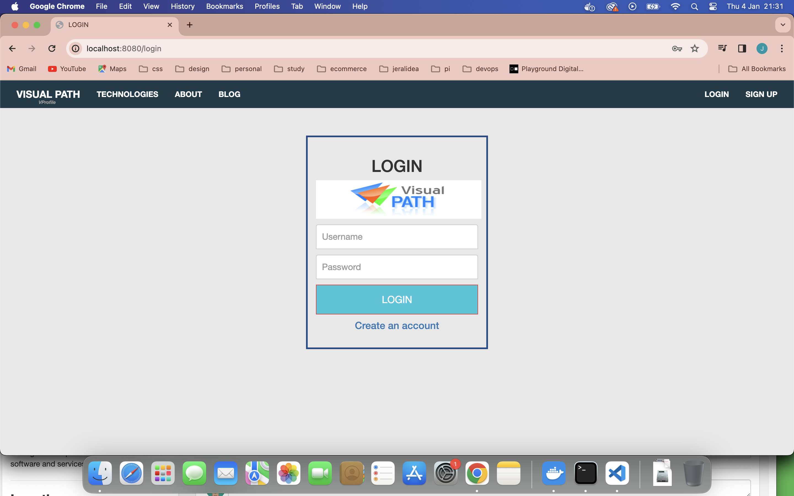
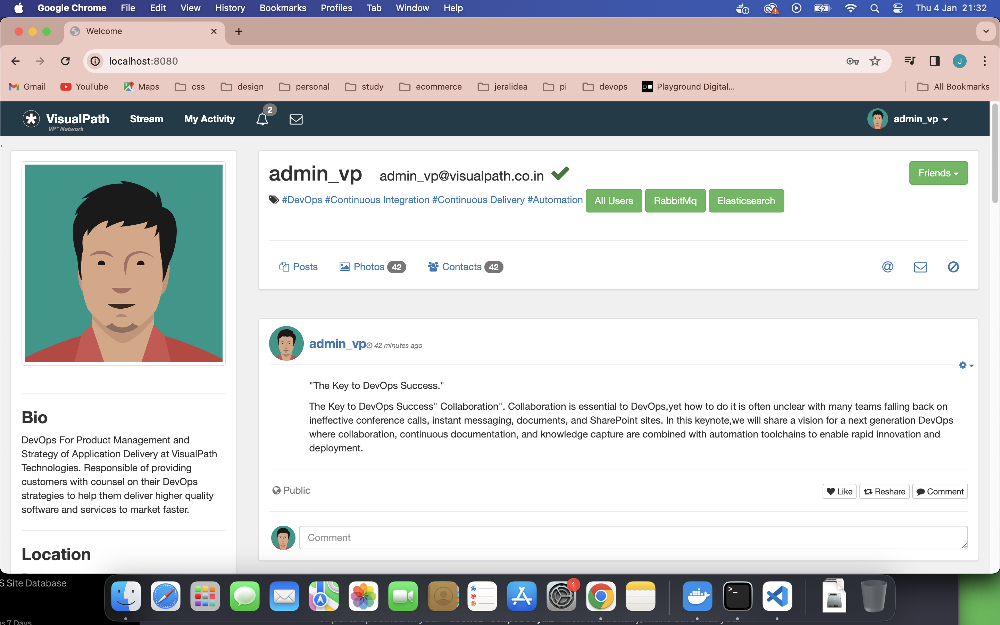
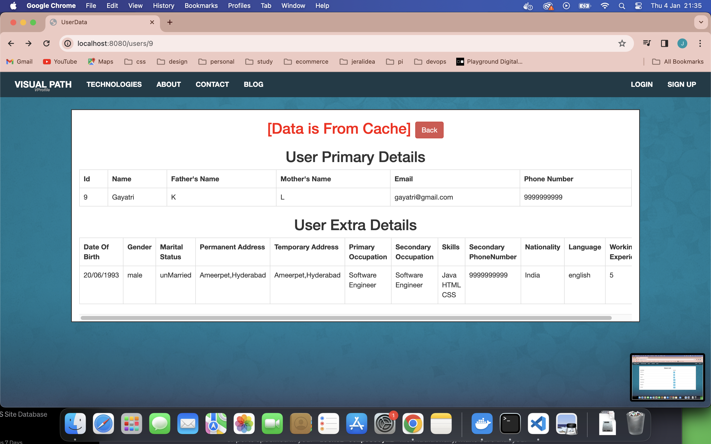
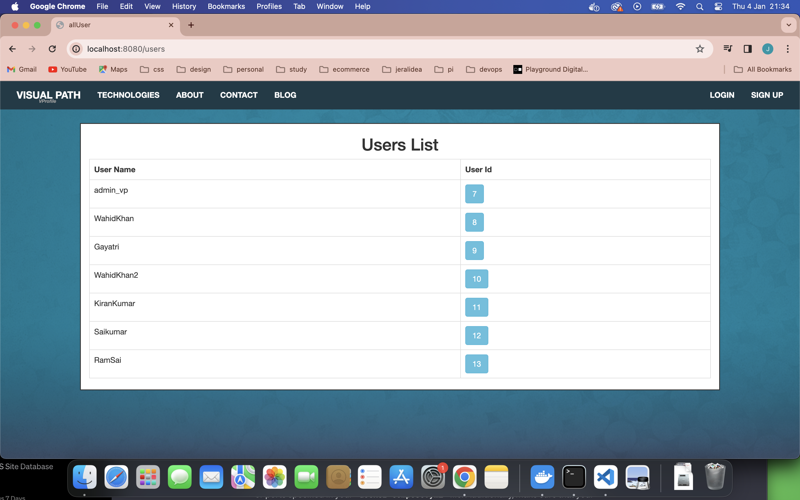
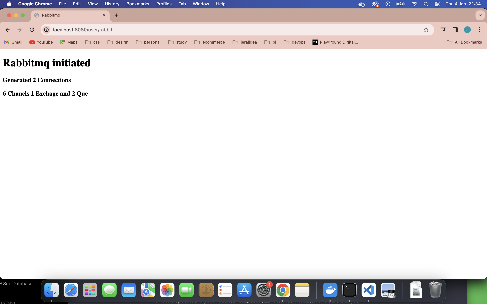

# Building my DevOps Portfolio 🚀

## Project 4: Containerization of Java aplication using Docker.

One of the benefits of working at EY is Udemy for Business. I decided to further enhance my DevOps skills by enrolling in the "DevOps Projects | 20 Real-Time DevOps Projects" course, and I'm sharing my journey for educational purposes.

### About:
- ✅ Multi Tier Application Stack.
- ✅ Running on VM’s.
- ✅ Regular deployment.
- ✅Continuous Changes.

### Problem: 
- ❌ High CapEx and OpEx.
- ❌ Human Errors in deployment.
- ❌ Not compatible with microservice architecture.
- ❌Resource wastage.
- ❌ Not portable, environment not in syncs.

### Solution:
- 🐳 Docker Containers.
- 🐳Consume low Resource.
- 🐳 Suit very well for microservice design.
- 🐳 Deployment via images.
- 🐳 Same container images across env.
- 🐳 Reusable and repeatable.

### Tools:
- 👩🏽‍💻 Docker (Container Runtime / Environment).
- 👩🏽‍💻 Java Stack (Vprofile Application services).

### Steps:
- ⏭️ Find right base image from dockerhub.
- ⏭️ Write dockerfile to customize images.
- ⏭️ Write docker compose.yml file to run multi containers.
- ⏭️ Test it and host images on dockerhub.

Summary Docker commands used: 
- 🐳 docker compose build.
- 🐳 docker-compose up -d
- 🐳 docker images
- 🐳 docker compose ps
- 🐳 docker compose down
- 🐳 docker system prune -a 

## Docker workflow diagram

## Automated Provisioning of the infrastructure evidence.

### Repository

GitHub Repository: [vprofile-project-3](https://github.com/jeraldinnemg/vprofile-project-containers)

Udemy Course: [DevOps Projects | 20 Real-Time DevOps Projects](https://www.udemy.com/course/devopsprojects/)

## Prerequisites
- JDK 1.8 or later
- Maven 3 or later
- MySQL 5.6 or later
######
## Technologies 
- Spring MVC
- Spring Security
- Spring Data JPA
- Maven
- JSP
- MySQL
## Database
Here,we used Mysql DB 
MSQL DB Installation Steps for Linux ubuntu 14.04:
- $ sudo apt-get update
- $ sudo apt-get install mysql-server

Then look for the file :
- /src/main/resources/accountsdb
- accountsdb.sql file is a mysql dump file.we have to import this dump to mysql db server
- > mysql -u <user_name> -p accounts < accountsdb.sql

